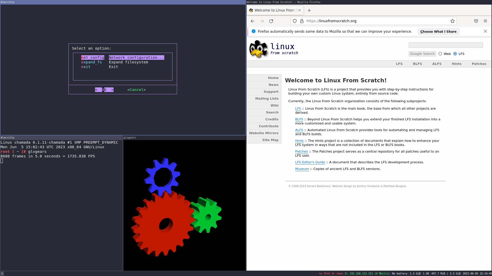

# ft_linux



This project aims to build a linux system by following the [Linux From Scratch](https://www.linuxfromscratch.org/lfs/) guide.

This repository contains build scripts, as well as a docker image that can be used to run these scripts.

The build scripts install all the packages from [LFS 11.3](https://www.linuxfromscratch.org/lfs/view/11.3/). Additionaly, some [BLFS](https://www.linuxfromscratch.org/blfs/) packages are provided, such as command-line utilities and the Xorg server.

## Prerequisites
- make
- docker

## Configuration
Various default settings can be configured using the docker environment variables in the `Dockerfile`.

## Building an image
To build the image, simply execute `make` in the parent directory of this repository.

The image should be stored by default at `dist/lfs.img`.
```
